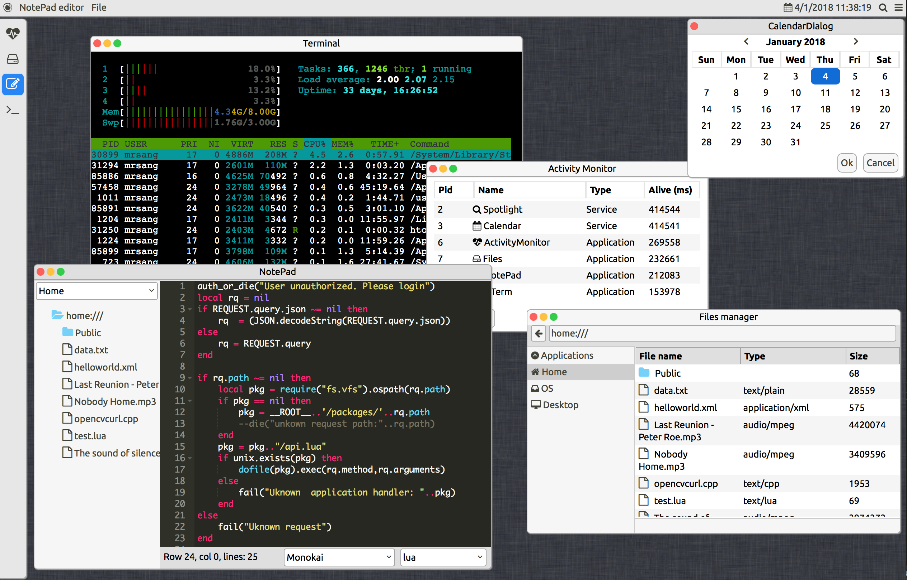

# antOS

Server or Embedded Linux are often headless, so accessing the resource on these systems is not always obvious. The aim of this project is to develop a client core API that enables desktop like experience to remote server resource accessing using web technologies. AntOS is based on jQuery and Riot, it is designed to be used along with our **antd** server and Lua based server side app, but it can also be adapted to any server side languages (PHP, etc) and server, by implementing all the system calls API defined in core/handlers/RemoteHandler.coffee. Basically, application design for the web os relies on these system calls to communicating with the server.  The API defines the core UI, system calls (to server), Virtual File system, virtual database and the necessary libraries for easing the development of webOS's applications. Applications can be developped with coffee/javascript/css without the need of a server side script.

Note that, the development of the project is in early alpha state, so bugs are very welcome :)
The WebOS is tested on recent Firefox, Chrome and Safari, however i did not test it on IE or Edge since i have no Windows device :)

## Demo
A demo of the web desktop is available at my page  [https://os.lxsang.me](https://os.lxsang.me) using username: demo and password: demo

 
## Build

Note that this is only the client API, to make it work for your application, you need to implement all the system calls in core/handlers/RemoteHandler.coffee using a server side scripting language (e.g. PHP). I'm planning to release an API documentation which describes what need to be sent and what will be returned for each system call in near future (i'm kind of very busy right now :) ).

I'm a big fan of the Make system, so i use it as a build system for all of my projects. So, to build AntOS:
1. You need to have *make* installed. Then since most of the API is written in Coffee script, you will need it to be installed too.
2. Edit the BUILDDIR variable in the Makefile file to point to where you want to put the built API
3. Type `make` then you are good to go.

It you have any problem, please contact me or open an issue, i'll try to response ASAP.

## Licence

Copyright 2017-2018 Xuan Sang LE <xsang.le AT gmail DOT com>

AnTOS is is licensed under the GNU General Public License v3.0, see the LICENCE file for more information

 This program is free software: you can redistribute it and/or modify
    it under the terms of the GNU General Public License as published by
    the Free Software Foundation, either version 3 of the License, or
    (at your option) any later version.

   This program is distributed in the hope that it will be useful,
    but WITHOUT ANY WARRANTY; without even the implied warranty of
    MERCHANTABILITY or FITNESS FOR A PARTICULAR PURPOSE.  See the
    GNU General Public License for more details.

   You should have received a copy of the GNU General Public License
    along with this program.  If not, see <https://www.gnu.org/licenses/>.

